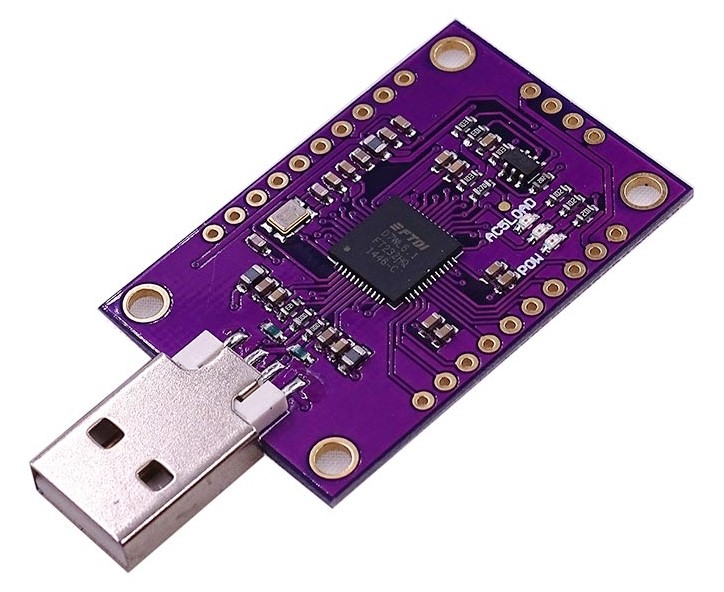

# Arduino + ESP32

In this project I used both the capabilities of the Arduino and ESP-IDF with FreeRTOS.

## PlatformIO Project Configuration

- Platform: WEMOS LOLIN32
- Framework: Arduino
- Upload Method:
  - esptool (Default)
  - jlink
  - esp-prog (Based on FT2232H or FT232H)
- Debug Method:
  - esp-prog (Based on FT2232H or FT232H)


## Board Pinout


## Notes

### Use only core 0 for demo purposes

Set `CONFIG_FREERTOS_UNICORE=y` in `sdkconfig.lolin32` to use only core 0 for demo purposes.

### Prevent `Task watchdog got triggered` warning

Add a small delay (10ms) to infinite loops to prevent `Task watchdog got triggered` warning.

- [Task watchdog got triggered - it is fixed with a vTaskDelay of 10ms but is this a bug? (IDFGH-5818) #1646](https://github.com/espressif/esp-idf/issues/1646)

Or you can set priority of all tasks to 0 (Idle). 

- [Task watchdog got triggered - The tasks did not reset the watchdog in time](https://stackoverflow.com/questions/66278271/task-watchdog-got-triggered-the-tasks-did-not-reset-the-watchdog-in-time)

### Debugging

Debugging feature of PlatformIO for Esp32 is buggy. But if you set the framework to Arduino, you can have a bit better
debugging experience than ESP-IDF framework.

The hardware used for debugging ESP32 is an FT232H USB-JTAG adapter:



Connect ESP32 to FT232H USB-JTAG adapter according to the following table:

| ESP32  | FT232H    |
| ------ | --------- |
| GPIO12 | AD1 (TDI) |
| GPIO13 | AD0 (TCK) |
| GPIO14 | AD3 (TMS) |
| GPIO15 | AD2 (TDO) |
| GND    | GND       |

For more information, read the following articles:

- [Low-cost ESP32 In-circuit Debugging](https://medium.com/@manuel.bl/low-cost-esp32-in-circuit-debugging-dbbee39e508b)
- [ESP32 JTAG debugging](https://nodemcu.readthedocs.io/en/dev-esp32/debug/)

### Get rid of Arduino setup() and loop()

Just start your program from `extern "C" void app_main(void)` instead of `void setup()` and `void loop()`.

### Run `menuconfig` in PlatformIO

```console
pio run -t menuconfig
```

    Note: Use `J` and `K` instead of up and down arrow keys to move between items in `menuconfig`

## References

- [WEMOS LOLIN32](https://docs.platformio.org/en/latest/boards/espressif32/lolin32.html)
- [ESP32 Hardware Serial2 Example](https://circuits4you.com/2018/12/31/esp32-hardware-serial2-example/)
- [GPIO Matrix and Pin Mux](https://espressif-docs.readthedocs-hosted.com/projects/arduino-esp32/en/latest/tutorials/io_mux.html)
- [ESP32 Digital Inputs & Digital Outputs – Arduino Tutorial](https://deepbluembedded.com/esp32-digital-inputs-outputs-arduino/)
- [Introduction to RTOS (YouTube)](https://www.youtube.com/watch?v=F321087yYy4&list=PLEBQazB0HUyQ4hAPU1cJED6t3DU0h34bz)
- [Introduction to RTOS (GitHub)](https://github.com/ShawnHymel/introduction-to-rtos)
- [Watchdogs](https://docs.espressif.com/projects/esp-idf/en/latest/esp32/api-reference/system/wdts.html)
- [Universal Asynchronous Receiver/Transmitter (UART)](https://docs.espressif.com/projects/esp-idf/en/latest/esp32/api-reference/peripherals/uart.html)
- [UART Echo Example](https://github.com/espressif/esp-idf/tree/master/examples/peripherals/uart/uart_echo)
- [Hello World with ESP32 Explained](https://exploreembedded.com/wiki/Hello_World_with_ESP32_Explained)
- [ESP-IDF for PlatformIO](https://docs.platformio.org/en/stable/frameworks/espidf.html)
- [ESP32 UART Communication using ESP-IDF](https://esp32tutorials.com/esp32-uart-tutorial-esp-idf/)
- [uxTaskGetStackHighWaterMark](https://www.freertos.org/uxTaskGetStackHighWaterMark.html)
- [Stop boot rom logs , panic handler logs on UART 0 on Esp-Wroom-32](https://github.com/espressif/esp-idf/issues/4836)
- [Why is volatile needed in C?](https://stackoverflow.com/questions/246127/why-is-volatile-needed-in-c)
- [ESP32 as I2C Master Tutorial (ESP-IDF)](https://embeddedexplorer.com/esp32-i2c-tutorial/)
- [How To Track Orientation with Arduino and ADXL345 Accelerometer](https://howtomechatronics.com/tutorials/arduino/how-to-track-orientation-with-arduino-and-adxl345-accelerometer/)
- [esp32-i2c-adxl345](https://github.com/imxieyi/esp32-i2c-adxl345)
- [ESP-IDF components](https://docs.platformio.org/en/latest/frameworks/espidf.html#esp-idf-components)
- [Measuring analog inputs with ESP32 ADC (ESP-IDF)](https://embeddedexplorer.com/esp32-adc-esp-idf-tutorial/)

### 1-Wire

- [onewire - Bit-banging one wire driver](https://esp-idf-lib.readthedocs.io/en/latest/groups/onewire.html)
- [onewire](https://github.com/UncleRus/esp-idf-lib/tree/master/components/onewire)
- [ds18x20 - Driver for DS18B20/DS18S20](https://esp-idf-lib.readthedocs.io/en/latest/groups/ds18x20.html)
- [ds18x20](https://github.com/UncleRus/esp-idf-lib/tree/master/components/ds18x20)
- [matjazv / ds18b20](https://github.com/matjazv/ds18b20)

### SPI

- [ESP32 SPI Master (ESP-IDF)](https://embeddedexplorer.com/esp32-spi-master/)
- [ESP32 SPI Master Slave Communication with ESP-IDF](https://esp32tutorials.com/esp32-spi-master-slave-communication-esp-idf/)
- [SPI master half duplex EEPROM example](https://github.com/espressif/esp-idf/tree/master/examples/peripherals/spi_master/hd_eeprom)
- [SPI Flash API](https://docs.espressif.com/projects/esp-idf/en/v4.4.3/esp32/api-reference/storage/spi_flash.html)

### File Systems

- [FAT FS on External Flash example](https://github.com/espressif/esp-idf/tree/master/examples/storage/ext_flash_fatfs)
- [SPIFFS file system limitations](https://arduino-esp8266.readthedocs.io/en/latest/filesystem.html#spiffs-file-system-limitations)
- [SPIFFS (SPI Flash File System)](https://github.com/pellepl/spiffs)
- [LittleFS](https://github.com/littlefs-project/littlefs)
- [SPIFFS Filesystem](https://docs.espressif.com/projects/esp-idf/en/v4.4.3/esp32/api-reference/storage/spiffs.html)
- [FAT Filesystem Support](https://docs.espressif.com/projects/esp-idf/en/v4.4.3/esp32/api-reference/storage/fatfs.html)
- [Wear Levelling API](https://docs.espressif.com/projects/esp-idf/en/v4.4.3/esp32/api-reference/storage/wear-levelling.html)
- [Virtual filesystem component](https://docs.espressif.com/projects/esp-idf/en/v4.4.3/esp32/api-reference/storage/vfs.html)
- [How to work on SPIFFS in ESP32 using ESP-IDF](https://www.youtube.com/watch?v=de44PvCmVVg)

### SPIFFS

- [SPIFFS example](https://github.com/espressif/esp-idf/tree/master/examples/storage/spiffs)
- [Create a custom partitions table (CSV) in PIO](https://docs.platformio.org/en/latest/platforms/espressif32.html#id19)
- [Creating Custom Tables (ESP-IDF)](https://docs.espressif.com/projects/esp-idf/en/latest/esp32/api-guides/partition-tables.html#creating-custom-tables)